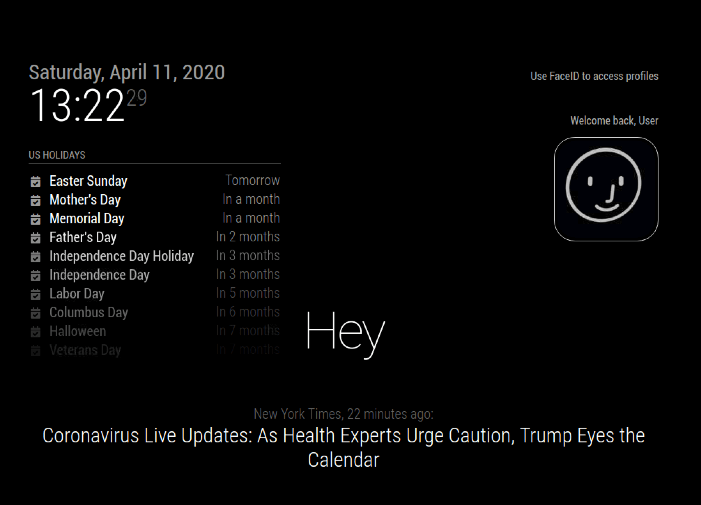
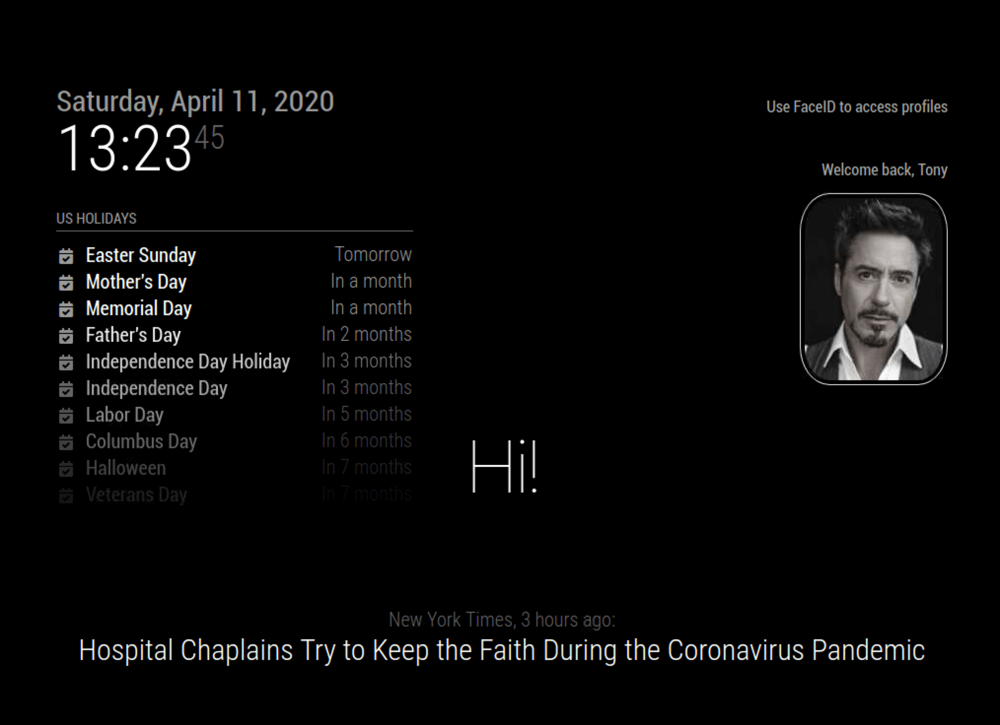

# MMM-AI-Face-Login
This is a module for the [MagicMirror²](https://github.com/MichMich/MagicMirror/) to add face recognition with profiles.

It is a fork of Eben Kouaos https://github.com/EbenKouao/MMM-Face-Recognition-SMAI. See his other projects at https://smartbuilds.io/

## How it works
This module allows you to access profiles using face recognition. This works on the back of MMM-Face-Reco-DNN/OpenCV face recognition module.

When a user is detected and logged in by Face Recognition Module a notification is recieved that will trigger the users profile pic ot be displayed
until the user is logged out by MMM-Face-Reco-DNN

## Screenshots
|  |  | 
|---|---|
| A guest profile as default | User has been recognised |

'Screenshots from Ebens Module'

## Preconditions

* MagicMirror<sup>2</sup> instance
* Node.js version >= 7
* npm
* [OpenCV face-recognition with DNN](https://github.com/nischi/MMM-Face-Reco-DNN)
* Raspberry Pi 4 Camera Module

Make sure to complete MMM-Face-Reco-DNN setup including adding classes for showing and hiding to your config before proceding.

## Step 1 – Install the module
In your MagicMirror directory:

```bash cd modules
   git clone https://github.com/jimbydude/MMM-AI-Face-Login.git
   cd MMM-AI-Face-Login
   npm install (not required unless you want to do testin/code checking etc)
```

## Step 2 – Add files to the Config.js
Here is an example for an entry in `config.js`

```javascript
{
  module: "MMM-AI-Face-Login",
  position: "top_right",
  config: {
    useMMMFaceRecoDNN: true
  }
}
```

## Step 3 – Configuring the Face Recognition Python Script
**Pre-requisite:** Follow isntructions in OpenCV Installation to setup your dataset with images.

This module assumes a few things:
* The default gif is in 'Public' folder
* There is an image for each user in the 'Public' folder that matches with user directory names in OpenCV Dataset

For example if you have the following structure containing your image set in OpenCV module:
```
- dataset
  - james
    - img01.jpg
    - img02.jpg
    - img03.jpg
  - roseann
    - img01.jpg
    - img02.jpg
    - img03.jpg
```

Then you will also have the following in the 'Public' folder of this module:
```
- public
    - guest.gif
    - james.jpg
    - roseann.jpg
```

These images are the ones that will be shown on the mirror UI when a user logs in, not the ones from dataset. Those are only to train the NN.

## Configuration options

| Option           | Description
|----------------- |-----------
| `useMMMFaceRecoDNN`        | *Required* Use the DNN deetction type. Currently only supported type. <br><br>**Type:** `bool` <br>Default true
